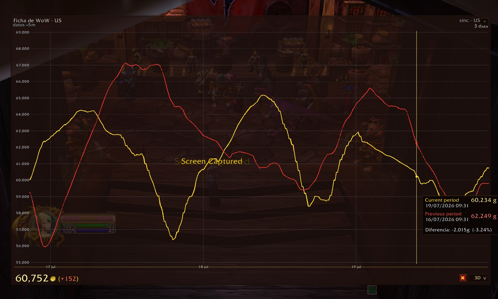

# TokenPanda

TokenPanda is an independent addon for **World of Warcraft: Mists of Pandaria Classic** that displays the current WoW Token price, recent price history, comparative data, and approximate trend projections directly in the game.

The project includes:

- **TokenPanda 1.1.0 Beta**: the in-game addon.
- **TokenPandaTray 1.1.0 Beta**: the portable Windows companion app used to download and synchronize historical data.

## Main features

- Current WoW Token price.
- Historical periods: 3D, 7D, 14D, 1M, 3M, 6M, and ALL.
- Comparison with the previous equivalent period.
- Approximate 6-hour and 12-hour trend projections in the 3D view.
- Possible rebound and trend-change notifications.
- Minimized, normal, and analysis views.
- Independent saved position for each view.
- Visual alerts for trends, proximity to lows, and new lows.
- Improved projected and comparative tooltips.
- Regions: US, EU, KR, and TW.
- Eleven interface languages.

## Download TokenPanda 1.1.0 Beta

TokenPanda requires both components:

### 1. TokenPanda Addon

[](https://github.com/EZ-Mouse/TokenPanda/releases/download/v1.1.0-beta/TokenPanda-1.1.0-beta.zip)

Install it in:

`World of Warcraft/_classic_/Interface/AddOns/`

### 2. TokenPandaTray

[](https://github.com/EZ-Mouse/TokenPanda/releases/download/v1.1.0-beta/TokenPandaTray-1.1.0-beta.zip)

TokenPandaTray is the portable Windows companion app that downloads and synchronizes the historical data used by the addon.

Version 1.1.0 Beta includes improvements to application stability and synchronization reliability.

[View the full release and release notes](https://github.com/EZ-Mouse/TokenPanda/releases/tag/v1.1.0-beta)

## Current public Beta

```text
TokenPanda 1.1.0 Beta
TokenPandaTray 1.1.0 Beta
```

Use matching versions of the addon and companion app. Both components must also use the same region.

## Quick installation

1. Close World of Warcraft.
2. Extract `TokenPanda-1.1.0-beta.zip`.
3. Copy the `TokenPanda` folder into:

```text
World of Warcraft/_classic_/Interface/AddOns/
```

4. Extract `TokenPandaTray-1.1.0-beta.zip`.
5. Run `TokenPandaTray.exe`.
6. Select your WoW folder and region.
7. Enable synchronization.
8. Start WoW and enter `/tokenpanda`.

See [USER_GUIDE.md](USER_GUIDE.md) for details.

## Updating from an earlier version

1. Close World of Warcraft.
2. Close TokenPandaTray.
3. Replace the existing `TokenPanda` addon folder with the new version.
4. Replace the previous TokenPandaTray executable with `TokenPandaTray.exe` from version 1.1.0 Beta.
5. Start TokenPandaTray and synchronize the historical data.
6. Start World of Warcraft.

Your existing configuration and historical data can continue to be used.

## Chart reference

- **Yellow line:** current-period price history.
- **Red line:** previous equivalent period.
- **Gray line:** approximate projected trend.

Projection is currently available in the 3D view.

## Projection notice

The projected values represent only a possible trend. They are not guaranteed future prices and should not be used as the sole basis for a decision.

Every decision must be made under the user's own judgment and must not depend exclusively on the trend prediction provided by the addon.

## Downloads

Public packages are distributed through **GitHub Releases**:

```text
TokenPanda-1.1.0-beta.zip
TokenPandaTray-1.1.0-beta.zip
SHA256SUMS.txt
```

## Preview



## Compatibility

- World of Warcraft: Mists of Pandaria Classic.
- Windows 10 and Windows 11, 64-bit, for TokenPandaTray.
- Regions: US, EU, KR, and TW.
- Interface languages: enUS, deDE, esES, esMX, frFR, itIT, koKR, ptBR, ruRU, zhCN, and zhTW.

## Privacy

TokenPandaTray does not require an account and does not request World of Warcraft or Battle.net credentials.

It only downloads public data and generates the local files required by the addon.

## Support and bug reports

Please use the repository's **GitHub Issues** section.

When reporting a synchronization problem, include:

- TokenPanda and TokenPandaTray versions.
- Selected region.
- Whether World of Warcraft was running.
- The relevant TokenPandaTray log, when available.

## Independent project

TokenPanda is independent and unofficial. It is not affiliated with, sponsored by, authorized by, or endorsed by Blizzard Entertainment or by the operators of any public data service used by the project.

World of Warcraft, WoW, and Blizzard Entertainment are trademarks or registered trademarks of Blizzard Entertainment, Inc.

## Author

**EZ-Mouse Dev.**

> Obsessed with perfection.
